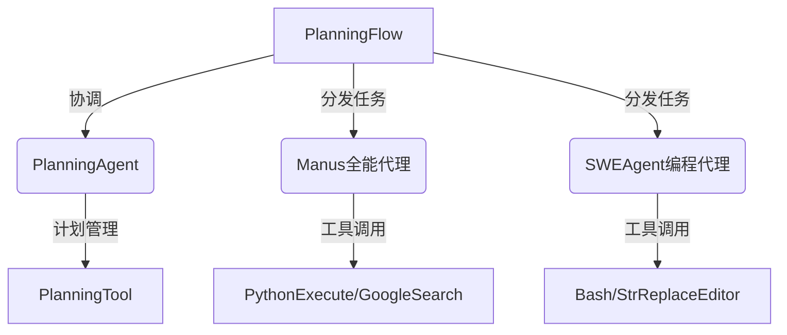

# Day4-Manus，OpenManus评测

[https://github.com/mannaandpoem/OpenManus](https://github.com/mannaandpoem/OpenManus)

1.openmanus安装方法，下载pycharm，python，git，都安装好，

2.配置方法

playwright install
`git clone https://github.com/mannaandpoem/OpenManus.git`

```jsx
# Global LLM configuration
[llm]
model = "deepseek-chat"
base_url = "https://api.deepseek.com"
api_key = "你的deepseek API-key"
max_tokens = 4096
temperature = 0.0

# Optional configuration for specific LLM models
[llm.vision]
model = "qwen-omni-turbo"
base_url = "https://dashscope.aliyuncs.com/compatible-mode/v1"
api_key = "你的通义千问API-key"
```

阿里示例代码：[什么是百炼_大模型服务平台百炼(Model Studio)-阿里云帮助中心](https://help.aliyun.com/zh/model-studio/getting-started/what-is-model-studio)

```jsx
import os
from openai import OpenAI

client = OpenAI(
    # 若没有配置环境变量，请用百炼API Key将下行替换为：api_key="sk-xxx",
    api_key="你的通义千问API-key", # 如何获取API Key：https://help.aliyun.com/zh/model-studio/developer-reference/get-api-key
    base_url="https://dashscope.aliyuncs.com/compatible-mode/v1",
)

completion = client.chat.completions.create(
    model="qwen-plus", # 模型列表：https://help.aliyun.com/zh/model-studio/getting-started/models
    messages=[
        {'role': 'system', 'content': 'You are a helpful assistant.'},
        {'role': 'user', 'content': '你是谁？'}
        ]
)
print(completion.choices[0].message.content)
```

3.使用方法

4.总结，目前Manus，openmanus都处于早期阶段，

部署项目，失败

分析股票，失败

写文章，失败

新建个网页教案，成功

新建个网页小游戏，失败



```jsx
# Global LLM configuration
[llm]
model = "deepseek-chat"
base_url = "https://api.deepseek.com"
api_key = "sk-84e15af752d340cd855bc6d417015c23qudiao"
max_tokens = 4096
temperature = 0.0

# Optional configuration for specific LLM models
[llm.vision]
model = "qwen-omni-turbo"
base_url = "https://dashscope.aliyuncs.com/compatible-mode/v1"
api_key = "sk-c3cb898b94434539919dd2cdaf08e536qudiao"
```

```jsx
import os
from openai import OpenAI

client = OpenAI(
    # 若没有配置环境变量，请用百炼API Key将下行替换为：api_key="sk-xxx",
    api_key="sk-c3cb898b94434539919dd2cdaf08e536qudiao", # 如何获取API Key：https://help.aliyun.com/zh/model-studio/developer-reference/get-api-key
    base_url="https://dashscope.aliyuncs.com/compatible-mode/v1",
)

completion = client.chat.completions.create(
    model="qwen-plus", # 模型列表：https://help.aliyun.com/zh/model-studio/getting-started/models
    messages=[
        {'role': 'system', 'content': 'You are a helpful assistant.'},
        {'role': 'user', 'content': '你是谁？'}
        ]
)
print(completion.choices[0].message.content)
```